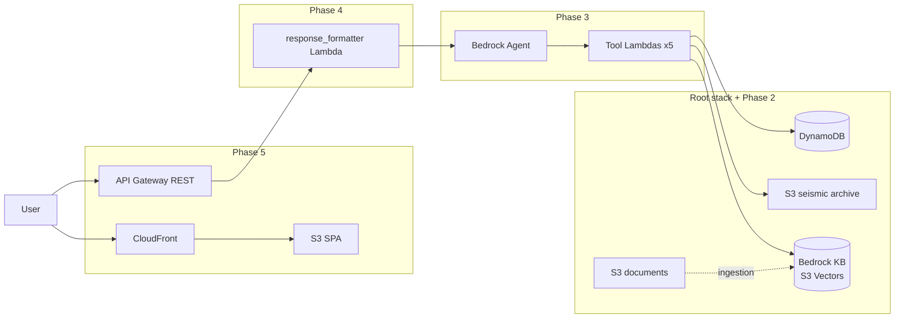
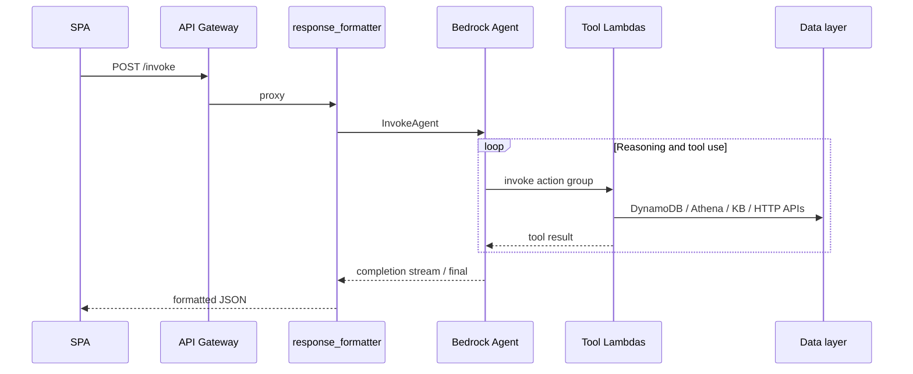

# GroundSense

AWS-native generative AI application: an Amazon Bedrock Agent with LLM tool use and retrieval-augmented generation (RAG) answers natural-language questions about earthquakes—live seismic APIs, DynamoDB and S3 data, PDF knowledge bases, and data visualization (maps and charts). Serverless architecture with Terraform (infrastructure as code), Python on AWS Lambda, API Gateway, EventBridge, CloudFront and S3 for the static site, and a React single-page app.

## What it does

Ask questions like:

- *"How many M4.0+ earthquakes hit Nova Scotia last year?"*
- *"Is today's Vancouver activity unusual?"*
- *"Should Halifax worry about tsunamis from Grand Banks earthquakes?"*

The agent chooses tools, pulls live and historical data, and answers with text plus maps and charts when useful.

## Architecture

GroundSense is deployed as **five Terraform stacks** under `infra/` (apply in order). Everything runs **serverless** in AWS; compute is **Lambda in a VPC** (private subnets + NAT) so outbound calls and **interface VPC endpoints** for Bedrock stay private. Gateway endpoints for **S3** and **DynamoDB** avoid NAT charges for those APIs.

### Request path (chat)




- **Web UI**: Vite/React build in **S3**, served via **CloudFront** (OAC, SPA error routes to `index.html`). See [deploy/phase_5.md](deploy/phase_5.md).
- **Public API**: **Regional REST API Gateway** `POST /invoke` → `**infra/phase4`** response formatter Lambda → `**bedrock:InvokeAgent**` on the agent alias.
- **Agent & tools**: Provisioned in `**infra/phase3`**. See **[Agentic AI architecture](#agentic-ai-architecture)** for the orchestration model, tool catalog, and safety layer.

### Data and analytics (root stack `infra/`)


| Module                  | Purpose                                                                                                                                                                                                           |
| ----------------------- | ----------------------------------------------------------------------------------------------------------------------------------------------------------------------------------------------------------------- |
| `**modules/vpc`**       | VPC `10.0.0.0/16`, public + private subnets, NAT, security group for Lambdas, **S3/DynamoDB gateway endpoints**, **Bedrock Runtime** and **Bedrock Agent Runtime** interface endpoints                            |
| `**modules/storage`**   | **DynamoDB** table (`earthquake_id`, TTL `expires_at`), **S3** `seismic-archive` (lifecycle to Glacier/Deep Archive), **S3** `documents` (versioning), **S3 event notifications** to alert + KB sync Lambdas      |
| `**modules/triggers`**  | **SNS** topic (+ optional email subscription), `**alert`** Lambda (reads `alerts/` prefix on archive bucket), `**kb_sync**` Lambda (starts Bedrock ingestion when `knowledge_base_id` / `data_source_id` are set) |
| `**modules/ingestors**` | `**seismic_poller**` (NRCan/USGS → DynamoDB + archive), `**document_fetcher**` (PDFs → documents bucket), **EventBridge Scheduler** targets (`rate(5 minutes)` poller, `cron(0 2 * * ? *)` document fetcher)      |
| `**modules/analytics`** | **Glue** catalog + **crawler** on `s3://…-seismic-archive/data/`, **Athena** workgroup + **S3** bucket for query results (7-day expiry on results)                                                                |
| `**modules/iamagen`**   | Optional **IAM user** + scoped **project-owner policy** for day-to-day Terraform/resource management (`iam_user_name`, default `groundsense-projectowner`)                                                        |


### Knowledge Base (`**infra/phase2`**)

Not OpenSearch: the KB uses **Amazon Bedrock** with **vector storage on S3 Vectors** (`aws_s3vectors_*`), **Amazon Titan Text Embeddings v2**, an **S3 data source** on the Phase 1 **documents** bucket, and fixed-size chunking. Walkthrough: [deploy/phase_2.md](deploy/phase_2.md).

### Observability (`**infra/phase4`**)

**CloudWatch dashboard** (`cloudwatch.tf`) aggregates **Lambda** built-in metrics for the response formatter and all five tool Lambdas, plus **custom metrics** from the formatter (`AgentTurnDurationMs`, `ToolCallsPerTurn`, success/failure). The formatter also exposes a **Lambda function URL** (CORS open; API Gateway is the primary integration in Phase 5).

### Phase 5 edge (`**infra/phase5`**)

Wires **API Gateway** to the **existing** formatter Lambda (by name), and creates the **frontend S3 bucket** (random suffix) + **CloudFront** distribution.

## Agentic AI architecture

GroundSense’s “agentic” layer is **Amazon Bedrock Agents**: a **foundation model** plans and answers in multiple turns, **invokes tools** (AWS Lambda action groups) when it needs data or retrieval, and can use **managed RAG** via the Bedrock Knowledge Base. Terraform: `**infra/phase3`** (`modules/bedrock_agent`, `modules/agent_tools`). Application code: `**lambda/response_formatter**`, `**lambda/tools/**`.

### Control flow

1. The **response formatter** (`infra/phase4`) calls `**bedrock:InvokeAgent`** on the agent **alias** (e.g. `v1`) with the user message and optional **session id** for multi-turn memory.
2. The **Bedrock Agent** (default model `us.anthropic.claude-sonnet-4-20250514-v1:0`) decides whether to answer directly or call **action groups**—each backed by one **Lambda** in the VPC.
3. The service **invokes those Lambdas** on behalf of the agent (no browser calls tools directly). Results return into the agent loop until the model produces a final answer; the formatter normalizes that output for the React client (text plus structured payloads for maps/charts where applicable).




### Action groups and tools

Each **action group** maps to one Lambda and one **OpenAPI-style function** exposed to the model (`infra/phase3/modules/bedrock_agent`).


| Action group               | Lambda (under `lambda/tools/`) | Role                                                          |
| -------------------------- | ------------------------------ | ------------------------------------------------------------- |
| **RecentDataQueries**      | `get_recent_earthquakes`       | Recent events from **DynamoDB** (TTL window)                  |
| **HistoricalAnalytics**    | `analyze_historical_patterns`  | **Athena** over Glue-cataloged **S3** archive                 |
| **KnowledgeBaseRetrieval** | `get_hazard_assessment`        | **Retrieve** from Bedrock Knowledge Base (reports, bulletins) |
| **LocationIntelligence**   | `get_location_context`         | Geocoding / place context + **KB**-backed narrative           |
| **WeatherContext**         | `fetch_weather_at_epicenter`   | **Open-Meteo** (and related logic) at epicenter coordinates   |


### Retrieval (RAG)

The **Knowledge Base** is created in `**infra/phase2`**: **S3** document bucket as data source, **S3 Vectors** + **Titan Embeddings v2**. The agent’s IAM role allows `**bedrock:Retrieve`** on that KB. Ingestion of new PDFs is driven from operations (S3 uploads + `**kb_sync**` in the root stack) and is separate from the chat request path.

### Safety and policy

- **Guardrails** (`aws_bedrock_guardrail`): topic policies (e.g. blocking **earthquake prediction** and harmful conspiracy framing). The resource is in Terraform; **whether the running agent attaches the guardrail** can be adjusted in code for testing—see `infra/phase3/modules/bedrock_agent/main.tf`.
- **System instruction** in the agent resource steers behavior (no predictions, cite documents, regional consistency on follow-ups).

### Observability

Custom and built-in metrics for the formatter and tool Lambdas are described under **Observability** in [Architecture](#architecture) (`infra/phase4` `cloudwatch.tf`).

Further setup: [deploy/phase_3.md](deploy/phase_3.md), [deploy/PHASE_3_STATUS.md](deploy/PHASE_3_STATUS.md).

## Data sources

All free; no API keys required:

- NRCan FDSN Event API (Canada, 1985–present)
- USGS FDSN Event API (global history)
- USGS real-time feed (~minute cadence upstream)
- Open-Meteo (weather at epicenters)

## Features

- Multi-turn chat with session memory
- Tool use for earthquakes, history, hazards, location context, weather
- Maps and charts in the UI
- RAG over uploaded bulletins and reports
- Bedrock guardrails (e.g. blocking earthquake *prediction* requests)
- Optional email alerts via SNS

## System components

### Data pipeline and analytics

Terraform entrypoint: `**infra/`** (root). Design goal: **low cost** — Lambdas invoked directly (no Kinesis).


| Piece                  | Role                                                                                                                |
| ---------------------- | ------------------------------------------------------------------------------------------------------------------- |
| `**seismic_poller`**   | NRCan + USGS → DynamoDB + S3 archive; schedule `**rate(5 minutes)**` (`infra/modules/ingestors/main.tf`)            |
| `**document_fetcher**` | GSC PDFs → `documents` bucket; daily **02:00 UTC** (`cron(0 2 * * ? *)`)                                            |
| **DynamoDB**           | Recent quakes; default **30-day TTL** (configurable)                                                                |
| **S3**                 | `seismic-archive` (date-partitioned lake), `documents` (PDFs)                                                       |
| `**alert`**            | On new objects under the alert path, read metadata and publish to **SNS** (set `alert_email` in `terraform.tfvars`) |
| `**kb_sync`**          | On new docs in S3, starts a **Knowledge Base ingestion job** when `knowledge_base_id` and `data_source_id` are set  |
| **Glue + Athena**      | Crawler on the archive; SQL in Athena for historical analysis                                                       |


Rough **data-only** AWS bill for light use: on the order of **$0.10–0.50/month** (mostly Lambda, storage, and ad hoc Athena; scheduler and S3 notifications are negligible).

### Knowledge Base (RAG)

Terraform: `**infra/phase2`**. Bedrock Knowledge Base with **S3 Vectors** storage and **Titan Embeddings v2**. Walkthrough: [deploy/phase_2.md](deploy/phase_2.md).

### Agent, guardrails, and tools

Terraform: `**infra/phase3`**. Full tool/action-group layout and runtime flow: **[Agentic AI architecture](#agentic-ai-architecture)**.

Agent setup: [deploy/phase_3.md](deploy/phase_3.md). Example environment checklist and tool checks: [deploy/PHASE_3_STATUS.md](deploy/PHASE_3_STATUS.md).

### Response formatter

Lambda that shapes agent output for the frontend. Terraform: `**infra/phase4`**. [deploy/phase_4.md](deploy/phase_4.md).

### Web app and public API

API Gateway in front of the formatter; static site for the UI. Terraform: `**infra/phase5**`. [deploy/phase_5.md](deploy/phase_5.md). Source: `**frontend/**` (Vite + React).

## Deployment

### Prerequisites

- AWS CLI configured
- Terraform ≥ 1.5
- Python **3.11+** (ingestors and formatter target 3.11; agent tool Lambdas in `**infra/phase3`** use **3.12** in Terraform)

### Terraform directories (apply in order)

Each folder has `terraform.tfvars.example`; use the previous stack’s outputs for the next. Guides under `**deploy/`** match these paths.

- `**infra/**` — storage, ingestors, triggers, analytics  
- `**infra/phase2**` — Knowledge Base  
- `**infra/phase3**` — Bedrock agent + tool Lambdas  
- `**infra/phase4**` — response formatter  
- `**infra/phase5**` — API Gateway + UI hosting

### Bootstrap the core stack

```bash
cd infra
cp terraform.tfvars.example terraform.tfvars
# Edit: alert_email; optional knowledge_base_id / data_source_id for kb_sync

terraform init
terraform apply
```

After the root stack, follow the `**deploy/**` guides linked above for each additional `infra/` subfolder you apply.

### Outputs

Run `terraform output` in each directory you applied. The root stack exposes table names, buckets, Lambda names, SNS ARN, Glue DB, and Athena workgroup. Later stacks add invoke URLs, CloudFront domain, etc.

## Testing

### Invoke Lambdas

```bash
aws lambda invoke \
  --function-name groundsense-dev-seismic-poller \
  --payload '{}' \
  response.json

aws lambda invoke \
  --function-name groundsense-dev-document-fetcher \
  --payload '{}' \
  response.json
```

(Replace `groundsense-dev` if you changed `project_name` / `environment`.)

### DynamoDB (recent events)

```bash
aws dynamodb scan \
  --table-name groundsense-dev-earthquakes \
  --max-items 10
```

### Athena (archive)

1. Athena console → workgroup `**groundsense-dev-seismic-analysis**` (or your configured name).
2. Query with partition values that exist in your lake:

```sql
SELECT *
FROM groundsense_dev_seismic_data.data
WHERE year = '2026'
LIMIT 10;
```

## Further reading

- Extended product roadmap and alternatives: [notes/Build Plan.md](notes/Build%20Plan.md)
- Deployment walkthroughs: `**deploy/**` (step-by-step guides and environment status notes)
- Design and session notes: `**notes/**` (e.g. `progress/`)

## Repository layout

```
groundsense/
├── infra/
│   ├── modules/          # vpc, storage, ingestors, triggers, analytics, iam
│   ├── main.tf           # root stack (pipeline + storage + triggers)
│   ├── phase2/           # Knowledge Base (S3 Vectors + Bedrock)
│   ├── phase3/           # Bedrock agent + tool Lambdas
│   ├── phase4/           # response formatter + observability dashboard
│   └── phase5/           # API Gateway + S3 + CloudFront
├── frontend/             # Vite + React SPA
├── lambda/
│   ├── alert/
│   ├── document_fetcher/
│   ├── kb_sync/
│   ├── response_formatter/
│   ├── seismic_poller/
│   └── tools/            # five agent tools
├── deploy/               # step-by-step AWS guides
└── notes/                # plans, architecture, progress
```

## License

MIT