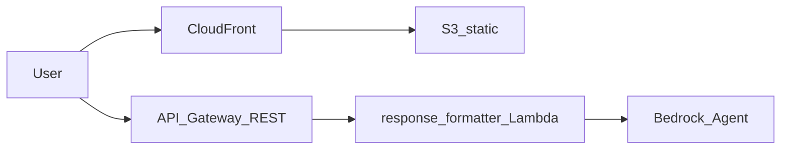

# Phase 5 Deployment Guide — Web UI + API Gateway

## Implementation status

**Completed**: Response formatter Lambda CORS on all HTTP responses; Terraform `infra/phase5` (regional REST API → existing formatter Lambda, S3 + CloudFront for static SPA); Vite + React + TypeScript app in `frontend/` with chat, session handling, and visualization routing (maps, line chart, stats, weather, documents).

## Architecture



- **Browser** loads the SPA from **CloudFront** (origin: private **S3** bucket, OAC).
- **Browser** calls **API Gateway** `POST …/invoke` (no API keys or usage plans in this prototype).
- **Lambda** is the Phase 4 **response formatter** (same code as Function URL path).

**Security note**: The API stage is open to the internet, like the Phase 4 Lambda Function URL. Use only for private demos until you add authentication and throttling.

## Prerequisites

- Phase 4 applied: formatter Lambda exists (`terraform output formatter_function_name` in `infra/phase4`).
- Formatter redeployed after pulling latest `lambda/response_formatter` (CORS on error responses).
- AWS CLI, Terraform >= 1.5, Node.js 20+ (for the frontend build).

## 1. Deploy Phase 5 infrastructure

```bash
cd infra/phase5
cp terraform.tfvars.example terraform.tfvars
# Set formatter_lambda_name from Phase 4:
#   cd ../phase4 && terraform output -raw formatter_function_name

terraform init
terraform apply
```

**Outputs**

| Output | Use |
|--------|-----|
| `api_invoke_url` | Full URL for `POST` (includes `/invoke`) |
| `frontend_bucket_id` | Target for `aws s3 sync` |
| `cloudfront_domain_name` | SPA hostname |
| `cloudfront_distribution_id` | Invalidation after uploads |

## 2. Configure and build the frontend

The app reads **`VITE_API_BASE_URL`**. You may set either:

- Full invoke URL (recommended): same value as `terraform output -raw api_invoke_url`, or  
- Stage root: `https://{api-id}.execute-api.{region}.amazonaws.com/dev` — the client appends `/invoke` if missing.

```bash
cd frontend
cp .env.example .env
# Edit .env — set VITE_API_BASE_URL=...

npm ci
npm run dev          # local dev with hot reload
npm run build        # produces dist/
```

## 3. Publish the SPA to S3 / CloudFront

```bash
BUCKET=$(cd ../infra/phase5 && terraform output -raw frontend_bucket_id)
DIST_ID=$(cd ../infra/phase5 && terraform output -raw cloudfront_distribution_id)

aws s3 sync dist/ "s3://${BUCKET}/" --delete
aws cloudfront create-invalidation --distribution-id "$DIST_ID" --paths "/*"
```

Open `https://{cloudfront_domain_name}` from the Phase 5 output.

## API contract

Same JSON request/response as Phase 4 — see [phase_4.md](./phase_4.md) (request: `query`, optional `session_id`; response: `message`, `session_id`, `visualization`).

## Quick test (curl)

```bash
URL=$(cd infra/phase5 && terraform output -raw api_invoke_url)
curl -sS -X POST "$URL" \
  -H 'Content-Type: application/json' \
  -d '{"query":"List recent earthquakes in Canada above magnitude 3"}' | jq .
```

## Optional: disable the Lambda Function URL

Phase 4 still creates a public Function URL. To avoid two public entry points, you can add a Terraform flag in Phase 4 later or remove the `aws_lambda_function_url` resource manually for non-prototype environments.

## Validation checklist

- [ ] `terraform apply` in `infra/phase5` succeeds  
- [ ] `curl` to `api_invoke_url` returns 200 and JSON  
- [ ] SPA loads from CloudFront and can send a question  
- [ ] Session id updates after first reply; follow-up uses same session  
- [ ] Map / chart / stat / weather / document views render for representative queries  

## References

- [API Gateway Lambda proxy](https://docs.aws.amazon.com/apigateway/latest/developerguide/set-up-lambda-proxy-integrations.html)  
- [CloudFront origin access control](https://docs.aws.amazon.com/AmazonCloudFront/latest/DeveloperGuide/private-content-restricting-access-to-s3.html)  
- Phase 4: [phase_4.md](./phase_4.md)  
